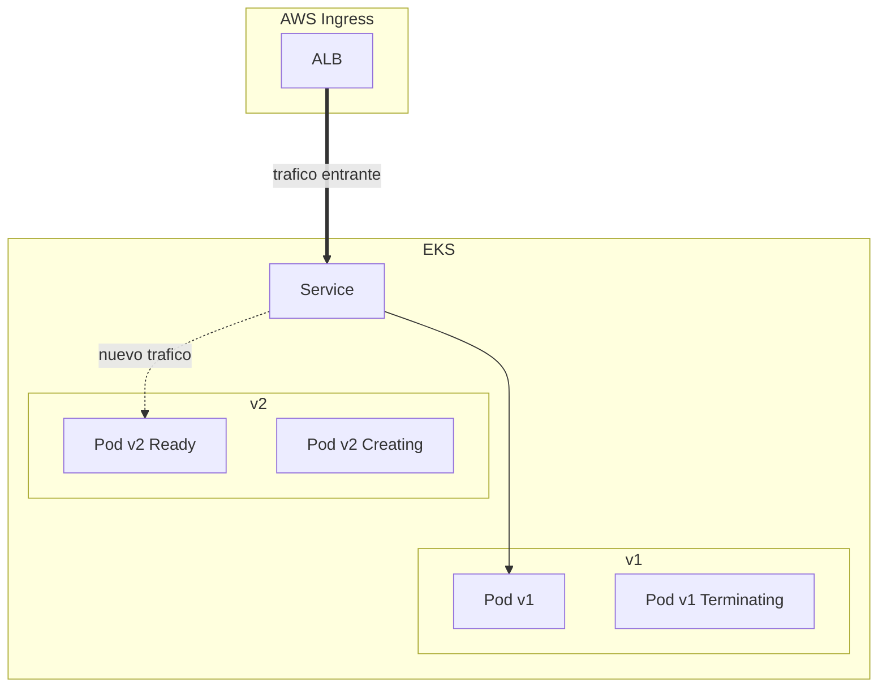

# Despliegue Continuo con Zero Downtime en EKS

Se puede lograr de multiples formas y herramientas, pero si nos enfocamos en lo basico y siempre disponible, Kubernetes y por tanto EKS ya proveen los mecanismos necesarios si la imagen sigue las buenas practicas para desarrollo enfocado a Kubernetes

## Rolling Release

### Service como LB

El Service asociado a un deployment ya actua como Load Balancer de los pods, por lo que el trafico solo sera dirigido a un pod que se encuentra listo para recibirlo. Conforme son reemplazados los pods viejos por los nuevos el service comienza tambien a redirigir el trafico, por tanto el balanceo ya comienza a darnos una parte del Zero Downtime



### Control de estrategia

A nivel del Deployment manifest no se requiere ser explicito en **la estrategia de despliegue porque por defecto es rollingUpdate**.

Sin embargo es mejor controlar el comportamiento para garantizar el Zero Downtime:

1. Se le debe indicar al controller que nunca debe dejarnos sin replicas activas, por lo que en caso de que solo existiera 1 replica al momento de iniciar la actualizacion se vera obligado a respetarla hasta tener listo el reemplazo.

2. Es mejor especificar que solo pueda ir generando 1 replica "extra" a la vez, con esto se vera obligado a avanzar el reemplazo 1 pod a la vez y no dejarnos sin replicas activas, garantizando un despliegue controlado.

3. Agregamos tambien un pequeño tiempo de espera para garantizar que tras completar el arranque del nuevo pod y por tanto permitir la destruccion de uno viejo, no se destruya de inmediato por si exista algun problema con la nueva replica. Sin la espera, el escenario de un crash de la nueva version efectivamente nos dejaria en 0.

```yaml
apiVersion: apps/v1
kind: Deployment
# Otras cosas...
spec:
  # Otras cosas...
  strategy:
    type: RollingUpdate
    rollingUpdate:
      maxSurge: 1
      maxUnavailable: 0
  minReadySeconds: 5
```

### Cuando y cuando actuar

Para saber esto se debe agregar "Probes", como minimo la que nos interesa es la **readinessProbe** que indica cuando considerar que el pod a completado su arranque y esta listo para que el service le envie trafico.

Cuando el pod sea considerado "ready", iniciara la destruccion de la replica vieja(o esperara unos segundos si usamos  **minReadySeconds**) y ya no hay marcha atras a esto(se puede un rollback, pero ya no hablamos de zero downtime a este punto).

```yaml
apiVersion: apps/v1
kind: Deployment
# Otras cosas...
spec:
  # Otras cosas...
  strategy:
    type: RollingUpdate
    rollingUpdate:
      maxSurge: 1
      maxUnavailable: 0
  minReadySeconds: 5
  template:
    spec:
      # Otras cosas...
      readinessProbe:
        httpGet:
          path: /healthz
          port: 8080
```

No esta demas controlar tambien el uso de ese probe:

```yaml
apiVersion: apps/v1
kind: Deployment
# Otras cosas...
spec:
  # Otras cosas...
  strategy:
    type: RollingUpdate
    rollingUpdate:
      maxSurge: 1
      maxUnavailable: 0
  minReadySeconds: 5
  template:
    spec:
      # Otras cosas...
      readinessProbe:
        httpGet:
          path: /healthz
          port: 8080
      initialDelaySeconds: 5
        periodSeconds: 10
        timeoutSeconds: 5
        failureThreshold: 5
```

### Riesgo de Downtime: Un mal inquilino

K8s solo puede confiar en lo que los workloads le indican para cumplir lo que hemos pedido, sin mas herramientas estamos ante un problema enorme: el readiness no es correcto.

Esto puede pasar por muchas razones incluyendo:

- se usa un endpoint incorrecto
- a nivel de codigo fuente se responde sin realmente estar listo
- no exista endpoint en primer lugar.

Tambien existe la posibilidad de que dado un tiempo de espera de quiza 5s para garantizar la estabilidad del nuevo pod, este termine en crash a los 10s por una razon u otra, con lo si ya se ha completado el reemplazo, efectivamente se llegara a Downtime aunque hemos tomado las medidas correctas.

### Riesgo menor: shutdown agresivo

Aunque el rolling update sea exitoso, existe posibilidad de que se afecte al usuario o a otros servicios de la arquitectura por una destruccion inmediata de la replica vieja que aun estaba realizando algo.

Se puede prevenir esto al agregar un tiempo de espera para un apagado controlado con **terminationGracePeriodSeconds** para permitir el cerrar conexiones a DBs, completar las ultimas peticiones recibidas y demas, aunque no siempre es necesario.
